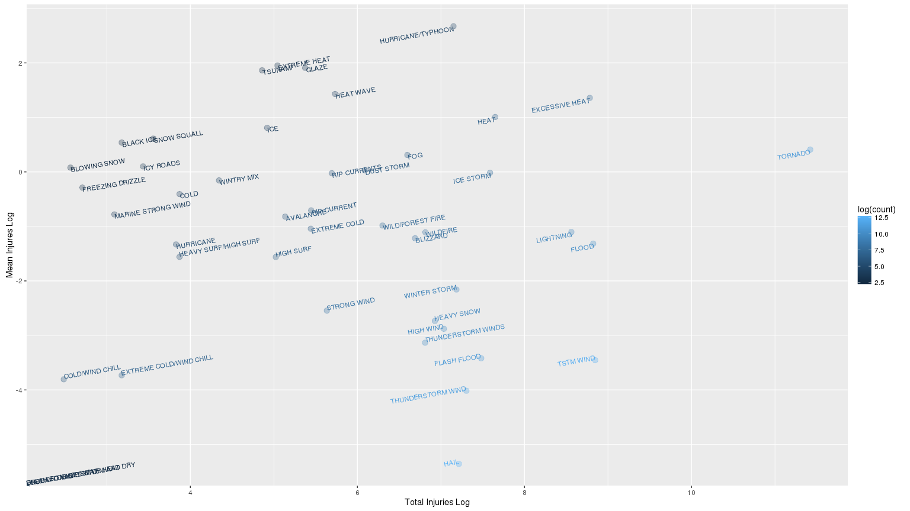
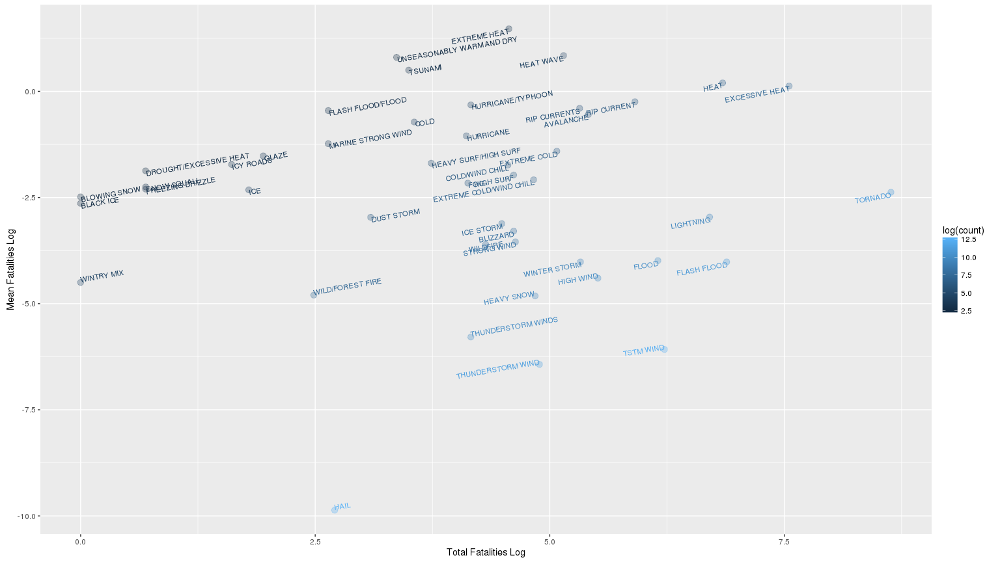
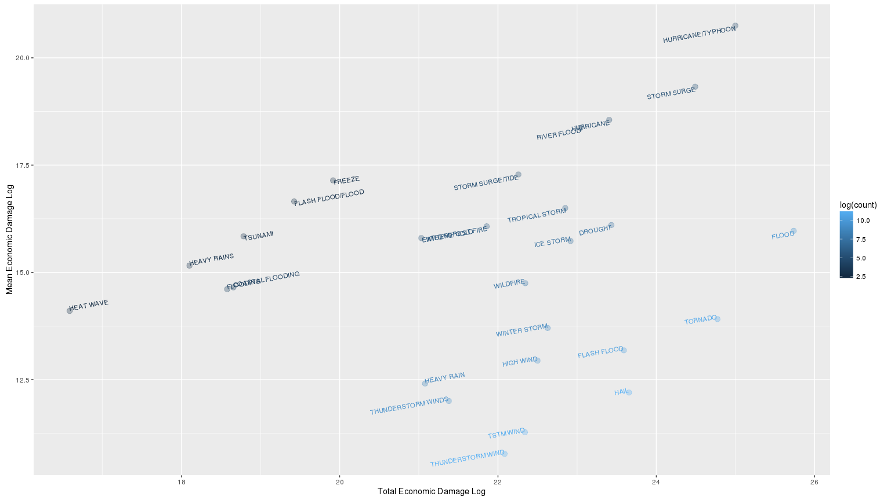

# Most harmful meteorological events
NighTurs  
December 27, 2015  

#Synopsis

In this report our goal is to find most harmful meteorological event types. Specifically we are interested in health harm (injuries, deaths) and economic damage. For that purpose we obtained sorm database collected by U.S. National Oceanic and Atmospheric Administration's (NOAA), it covers various weather events from 1950 to 2011 years. Based on set of parameters we found event candidates that appear to have most grave effects. From health perspective they are: hurricane/typhoon, excessive heat, tornado. Most economic consequences are caused by: hurricane/typhoon, flood.

#Data processing

Dataset is obtained from [U.S. National Oceanic and Atmospheric Administration's (NOAA) storm database](https://www.ncdc.noaa.gov/stormevents), and contains records of significant meteorological events. Link also contains various details and documentation.

##Read dataset

Load packages used throughout research.

```r
library(data.table)
library(dplyr)
library(ggplot2)
```

First read data, that is .csv file in bz2 archive.

```r
storm_raw <- data.table(read.csv(bzfile('data/repdata-data-StormData.csv.bz2')))
```

Check dimensions and first few rows.

```r
dim(storm_raw)
```

```
## [1] 902297     37
```

```r
head(storm_raw, 5)
```

```
##    STATE__           BGN_DATE BGN_TIME TIME_ZONE COUNTY COUNTYNAME STATE
## 1:       1  4/18/1950 0:00:00     0130       CST     97     MOBILE    AL
## 2:       1  4/18/1950 0:00:00     0145       CST      3    BALDWIN    AL
## 3:       1  2/20/1951 0:00:00     1600       CST     57    FAYETTE    AL
## 4:       1   6/8/1951 0:00:00     0900       CST     89    MADISON    AL
## 5:       1 11/15/1951 0:00:00     1500       CST     43    CULLMAN    AL
##     EVTYPE BGN_RANGE BGN_AZI BGN_LOCATI END_DATE END_TIME COUNTY_END
## 1: TORNADO         0                                               0
## 2: TORNADO         0                                               0
## 3: TORNADO         0                                               0
## 4: TORNADO         0                                               0
## 5: TORNADO         0                                               0
##    COUNTYENDN END_RANGE END_AZI END_LOCATI LENGTH WIDTH F MAG FATALITIES
## 1:         NA         0                      14.0   100 3   0          0
## 2:         NA         0                       2.0   150 2   0          0
## 3:         NA         0                       0.1   123 2   0          0
## 4:         NA         0                       0.0   100 2   0          0
## 5:         NA         0                       0.0   150 2   0          0
##    INJURIES PROPDMG PROPDMGEXP CROPDMG CROPDMGEXP WFO STATEOFFIC ZONENAMES
## 1:       15    25.0          K       0                                    
## 2:        0     2.5          K       0                                    
## 3:        2    25.0          K       0                                    
## 4:        2     2.5          K       0                                    
## 5:        2     2.5          K       0                                    
##    LATITUDE LONGITUDE LATITUDE_E LONGITUDE_ REMARKS REFNUM
## 1:     3040      8812       3051       8806              1
## 2:     3042      8755          0          0              2
## 3:     3340      8742          0          0              3
## 4:     3458      8626          0          0              4
## 5:     3412      8642          0          0              5
```

##Preprocessing

We won't use majority of the columns. Interesting to us are those:

* EVTYPE - type of meteorological event
* FATALITIES - count of deaths
* INJURIES - count of injures
* PROPDMG - property damage in dollars without magnitude
* PROPDMGEXP - magnitude for property damage, Ex: M - millions
* CROPDMG - damage to crops in dollars without magnitude
* CROPDMGEXP - magnitude for crops damage, Ex: M - millions

First assign them proper names.

```r
storm <- select(storm_raw, EVTYPE, FATALITIES, INJURIES, 
                PROPDMG, PROPDMGEXP, CROPDMG, CROPDMGEXP) %>%
    rename(event.type = EVTYPE, fatalities = FATALITIES, injuries = INJURIES, 
           property.damage = PROPDMG, property.damage.magnitude = PROPDMGEXP,
           crop.damage = CROPDMG, crop.damage.magnitude = CROPDMGEXP)
```

Now we want to merge damage variables with magnitude, so that they will be measured in dollars. 
Lets check for different magnitudes we have.

```r
table(storm$property.damage.magnitude, useNA = 'ifany')
```

```
## 
##             -      ?      +      0      1      2      3      4      5 
## 465934      1      8      5    216     25     13      4      4     28 
##      6      7      8      B      h      H      K      m      M 
##      4      5      1     40      1      6 424665      7  11330
```

```r
table(storm$crop.damage.magnitude, useNA = 'ifany')
```

```
## 
##             ?      0      2      B      k      K      m      M 
## 618413      7     19      1      9     21 281832      1   1994
```

Official documentation mentions that “K” means thousands, “M” - millions, and “B” - billions. Meaning of other codes is not clear. We will assume that "k", "m", "b" have the same meaning as capital letters. Except for empty values, others are relatively rare and it should be safe to treat them as NA. 

But we can't dismiss empty values that easily. 

```r
table(storm[property.damage.magnitude == '', property.damage])
```

```
## 
##      0   0.41      1      2      3      4      5      6      7      8 
## 465858      1      4      7     16      9     11      6      3      2 
##      9     10     20     35     75 
##      3      8      4      1      1
```

```r
table(storm[crop.damage.magnitude == '', crop.damage])
```

```
## 
##      0      3      4 
## 618410      1      2
```

It seems like most empty magnituides have zero in damage column. There are three likely scenarious:

1. No damage has been done
2. Damage is unknown
3. Combination of 1 and 2

We will go with second option. This decisions most likely will have strong impact. For example if truth is 1, then it means our overall estimations of property damage will be biased only to events that cased some damage, and we will completely ignore ones that did not.

Finally let's finish damage variables merge.

```r
knownExp <- c('K', 'k', 'M', 'm', 'B', 'b')
expLookup <- data.table(property.damage.magnitude = knownExp, 
                        damage.mult = as.integer(c(10^3, 10^3, 10^6, 
                                                   10^6, 10^9, 10^9)))

storm <- left_join(storm, expLookup, by = 'property.damage.magnitude') %>% 
    mutate(property.damage = property.damage * damage.mult) %>% 
    select(-damage.mult, -property.damage.magnitude)

expLookup <- rename(expLookup, crop.damage.magnitude = property.damage.magnitude)

storm <- left_join(storm, expLookup, by = 'crop.damage.magnitude') %>% 
    mutate(crop.damage = crop.damage * damage.mult) %>% 
    select(-damage.mult, -crop.damage.magnitude)
```

#Results

##Most harmful event for population health

Damage to population health will be estimated from 'fatalities' and 'injuries'. Because it is hard to bring those variables to the same scale (1 death != 1 injury), we will use them separately. For each event we will calculate mean and total for deaths and injuries. Mean will answer how much cases we see on average, but won't capture that some events are more rare than others. Total is good at capturing both severity and frequency of events, but to trust it we need to be sure that all events get same attentions (which is obviously not true).

Also we will be interested only in event types that have 10 or more records. Assuming that otherwise event type doesn't have enough data to be trusted.

```r
health.harm <- storm %>% group_by(event.type) %>% 
    summarise(total.injuries = sum(injuries),
              mean.injuries = mean(injuries),
              total.fatalities = sum(fatalities),
              mean.fatalities = mean(fatalities),
              count = n()) %>%
    filter(count > 10)
```

Now we will pick candidates for most harmful event types. We do that by getting top 20 events based on each metric we use. Then we get union of those sets. It will roughly give us most interesting cases.

```r
candidate.rows <- unique(combine(tail(order(health.harm$total.injuries), 20),
                          tail(order(health.harm$mean.injuries), 20),
                          tail(order(health.harm$total.fatalities), 20),
                          tail(order(health.harm$mean.fatalities), 20)))

health.harm.candidates <- health.harm[candidate.rows]
health.harm.candidates$event.type
```

```
##  [1] DUST STORM                WILD/FOREST FIRE         
##  [3] FOG                       BLIZZARD                 
##  [5] THUNDERSTORM WINDS        WILDFIRE                 
##  [7] HEAVY SNOW                HIGH WIND                
##  [9] HURRICANE/TYPHOON         WINTER STORM             
## [11] HAIL                      THUNDERSTORM WIND        
## [13] FLASH FLOOD               ICE STORM                
## [15] HEAT                      LIGHTNING                
## [17] EXCESSIVE HEAT            FLOOD                    
## [19] TSTM WIND                 TORNADO                  
## [21] COLD                      FREEZING DRIZZLE         
## [23] WINTRY MIX                RIP CURRENTS             
## [25] BLOWING SNOW              ICY ROADS                
## [27] BLACK ICE                 SNOW SQUALL              
## [29] ICE                       HEAT WAVE                
## [31] TSUNAMI                   GLAZE                    
## [33] EXTREME HEAT              HIGH SURF                
## [35] STRONG WIND               EXTREME COLD/WIND CHILL  
## [37] EXTREME COLD              AVALANCHE                
## [39] RIP CURRENT               DROUGHT/EXCESSIVE HEAT   
## [41] COLD/WIND CHILL           HEAVY SURF/HIGH SURF     
## [43] MARINE STRONG WIND        HURRICANE                
## [45] FLASH FLOOD/FLOOD         UNSEASONABLY WARM AND DRY
## 985 Levels: ? ABNORMALLY DRY ABNORMALLY WET ... WND
```

Let's plot total and mean injuries relation. Top right points is what we will be looking for. Log transformations are used to reduce skew. Also we will color points based on how much observations we have for that event type.

```r
ggplot(health.harm.candidates, 
       aes(log(total.injuries), log(mean.injuries), label = event.type, color = log(count))) + 
    geom_point(size = 3, alpha = 0.3) + 
    geom_text(vjust = 'inward', hjust = 'inward', angle = 10, size = 3) +
    labs(x = 'Total Injuries Log', y = 'Mean Injures Log')
```

 

Same plot only for fatalities.

```r
ggplot(health.harm.candidates, 
       aes(log(total.fatalities), log(mean.fatalities), label = event.type, color = log(count))) + 
    geom_point(size = 3, alpha = 0.3) + 
    geom_text(vjust = 'inward', hjust = 'inward', angle = 10, size = 3) +
    labs(x = 'Total Fatalities Log', y = 'Mean Fatalities Log')
```

 

Based on injuries we have : HURRICANE/TYPHOON, EXCESSIVE HEAT, TORNADO (from more mean to more total). Based on fatalities: EXTREME HEAT, HEAT WAVE, HEAT, EXCESSIVE HEAT, TORNADO (from more mean to more total). Each of them can be considered to be most harmful event for health, unless we know how to prioritize over mean and total.

##Events with the greatest economic consequences

Economic damage can be estimated from 'crop.damage' and 'property.damage' variables. Here we will take similar approach to what we have done with health harm,w e will calculate total and mean for the same reasons. 

Unlike 'fatalities' and 'injuries' we know that crop and property damage are both measured with dollars. Because our interest is economic damage will sum up those variables.

```r
econ.harm <- storm %>% 
    filter(!is.na(property.damage) | !is.na(crop.damage)) %>% 
    mutate(property.damage = replace(property.damage, is.na(property.damage), 0),
           crop.damage = replace(crop.damage, is.na(crop.damage), 0)) %>%
    group_by(event.type) %>% 
    summarise(total.econ.damage = sum(property.damage + crop.damage),
              mean.econ.damage = mean(property.damage + crop.damage),
              count = n()) %>%
    filter(count > 10)
```

With same technique as for health harm we will pick create union of 20 top event types for each measurement.

```r
candidate.rows <- unique(combine(tail(order(econ.harm$total.econ.damage), 20),
                                 tail(order(econ.harm$mean.econ.damage), 20)))

econ.harm.candidates <- econ.harm[candidate.rows]
econ.harm.candidates$event.type
```

```
##  [1] HEAVY RAIN         THUNDERSTORM WINDS WILD/FOREST FIRE  
##  [4] THUNDERSTORM WIND  STORM SURGE/TIDE   TSTM WIND         
##  [7] WILDFIRE           HIGH WIND          WINTER STORM      
## [10] TROPICAL STORM     ICE STORM          RIVER FLOOD       
## [13] HURRICANE          DROUGHT            FLASH FLOOD       
## [16] HAIL               STORM SURGE        TORNADO           
## [19] HURRICANE/TYPHOON  FLOOD              HEAT WAVE         
## [22] FLOODING           COASTAL FLOODING   HEAVY RAINS       
## [25] EXTREME COLD       TSUNAMI            FLASH FLOOD/FLOOD 
## [28] FREEZE            
## 985 Levels: ? ABNORMALLY DRY ABNORMALLY WET ... WND
```

Create same type of plot as for health damage, now for economic damage. Again we will use log transformations to reduce skew.

```r
ggplot(econ.harm.candidates, 
       aes(log(total.econ.damage), log(mean.econ.damage), label = event.type, color = log(count))) +     geom_point(size = 3, alpha = 0.3) + 
    geom_text(vjust = 'inward', hjust = 'inward', angle = 10, size = 3) +
    labs(x = 'Total Economic Damage Log', y = 'Mean Economic Damage Log')
```

 

Here we clearly have two winners: HURRICANE/TYPHOON, FLOOD. FLOOD with highest total damage, HURRICANE/TYPHOON with highest mean.

```r
econ.harm.candidates[event.type %in% c('HURRICANE/TYPHOON', 'FLOOD')]
```

```
## Source: local data table [2 x 4]
## 
##          event.type total.econ.damage mean.econ.damage count
##              (fctr)             (dbl)            (dbl) (int)
## 1 HURRICANE/TYPHOON       71913712800       1027338754    70
## 2             FLOOD      150319678250          8605432 17468
```
